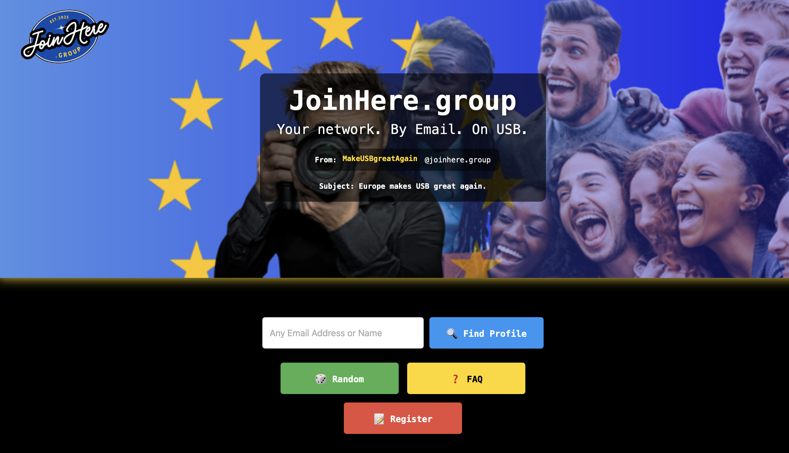
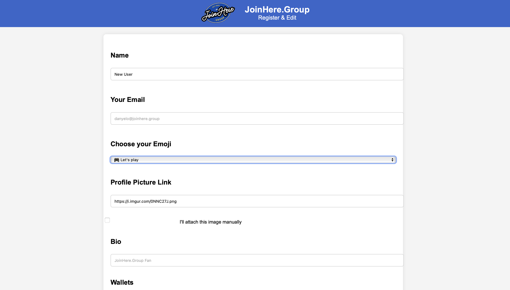

# JoinHere · Offline Edition

> A fully offline, remixable social network in a single ZIP file.  
> No login. No tracking. No JavaScript required.

---

## 📦 What’s Inside

- ✔️ Over 85 handcrafted HTML pages  
- 🗂️ Lightweight (~10 MB)  
- 💾 Works offline from USB, SD card, or shared folder  
- 🧑‍💻 100% editable with any text editor or browser  

---

## 🚀 Get Started

1. **Download the ZIP**  
2. **Unzip and open** `index.html`  
3. **Create your profile** via `register.html`  
4. **Save & Share** with friends or send to `upload@joinhere.group`  

You are the user.  
You are the host.  
You are the platform.

---

## 📷 Screenshots

| Homepage | Register Form | Profile Page |
|----------|----------------|--------------|
|  |  |  |

---

## 📨 ZIP by Email

Send a blank email to:  
📧 **zip@joinhere.info**  
You’ll receive the latest ZIP via autoresponder. *(Check spam! It’s `.info`, not `.group`)*

---

## 🔗 Official JoinHere Domains

- [joinhere.group](https://joinhere.group) – Main  
- [joinhere.info](https://joinhere.info) – Mirror  
- [joinhere.org](https://joinhere.org) – Organisation  
- [joinhere.chat](https://joinhere.chat) – Talk  
- [joinhere.news](https://joinhere.news) – News  
- [joinhere.email](https://joinhere.email) – Zip  
- [joinhere.church](https://joinhere.church) – Follow  

⚠️ Any other domains using "joinhere" are not officially part of this project.

---

## 🔧 Customize JoinHere

You may change:

- The logo (replace the image file)  
- First group + default friend in `register.html`  
- Email rotation & random page list in `index.html`  
- Titles & footers across the core pages  

Just regenerate via `register.html`.  
No permission required — but if you believe in the vision, build **with us**, not next to us.

📧 hello@joinhere.group

---

## ✅ Do:
- Remix and adapt freely  
- Credit the origin:
  - `joinhere.group` (the platform)  
  - or `Danyelo Dolce` (the creator)  
- Help others build a better internet

## 🚫 Don’t:
- Sell it without adding value  
- Remove all references and claim it’s yours

---

## 📷 Image Credits

All images used in this project are licensed via [Pexels.com](https://www.pexels.com) & [Canva.com](https://www.canva.com).  
We thank the amazing creators for making their work freely available.

---

## 📊 Changelog

### v1.0 – 2025-03-25
- First ZIP release (74 HTML pages, ~21MB)  
- Offline social network  
- Online footer + logo still active  

### v1.1 – 2025-03-26
- ZIP updated (85 HTML pages, ~6.5MB)  
- Full offline emoji system, compressed assets  
- Uploaded to GitHub, Pinata, joinhere.group  
- USB version launched  

### v1.2 – 2025-03-28
- Polygon & OpenSea integration: JOIN token + NFTs  
- Rewritten register.html with API + Wallet checks  
- Mobile fixes, download/send offline  
- Better form UX + jokes 😎  

### v1.3 – 2025-03-30
- Sitemap, Logbook + Dev Access added  
- `log.html` now lists test builds + form versions  
- Email & Domain profiles created  
- Pexels image credit + license finalized  
- GitHub README prepared with markdown and screenshots  

---

© 2025 [joinhere.group](https://joinhere.group)  
🏢 Created by [joinhere.org](https://joinhere.org)  
🎬 A project by [celebcare.media](https://celebcare.media)  
🔌 Powered by [web3.li](https://web3.li)  
❤️ Made with 🍕 by [danyelo.de](https://danyelo.de)
